# Báo Cáo Phân Tích Khám Phá Dữ Liệu (EDA) End-to-End

> **Bài toán**: Dự đoán lỗi phần mềm (Software Defect Prediction)
> **Tập dữ liệu**: NASA Metrics Data Program (MDP) - 10 Datasets công khai
> **Ngày thực hiện**: 2026-05-20

## 1. Tổng Quan Toàn Bộ 10 Bộ Dữ Liệu

Dưới đây là bảng thống kê tổng hợp cấu trúc, chất lượng dữ liệu và mức độ mất cân bằng lớp trên cả 10 dataset:

| Bộ Dữ Liệu | Tổng Mẫu (Mô-đun) | Đặc Trưng (Features) | Mẫu Trùng Lặp (%) | Dữ Liệu Thiếu (NaN) | Lớp Sạch (Clean) | Lớp Lỗi (Defective) |
| :--- | :---: | :---: | :---: | :---: | :--- | :--- |
| **JM1** | 7720 | 21 | 0 (0.00%) | 0 (0.00%) | 6108 (79.12%) | 1612 (20.88%) |
| **KC3** | 194 | 39 | 0 (0.00%) | 0 (0.00%) | 158 (81.44%) | 36 (18.56%) |
| **MC1** | 1952 | 38 | 0 (0.00%) | 0 (0.00%) | 1916 (98.16%) | 36 (1.84%) |
| **MC2** | 124 | 39 | 0 (0.00%) | 0 (0.00%) | 80 (64.52%) | 44 (35.48%) |
| **MW1** | 250 | 37 | 0 (0.00%) | 0 (0.00%) | 225 (90.00%) | 25 (10.00%) |
| **PC1** | 679 | 37 | 0 (0.00%) | 0 (0.00%) | 624 (91.90%) | 55 (8.10%) |
| **PC2** | 722 | 36 | 0 (0.00%) | 0 (0.00%) | 706 (97.78%) | 16 (2.22%) |
| **PC3** | 1053 | 37 | 0 (0.00%) | 0 (0.00%) | 923 (87.65%) | 130 (12.35%) |
| **PC4** | 1270 | 37 | 0 (0.00%) | 0 (0.00%) | 1094 (86.14%) | 176 (13.86%) |
| **PC5** | 1694 | 38 | 0 (0.00%) | 0 (0.00%) | 1236 (72.96%) | 458 (27.04%) |

### Biểu Đồ So Sánh Sự Mất Cân Bằng Lớp

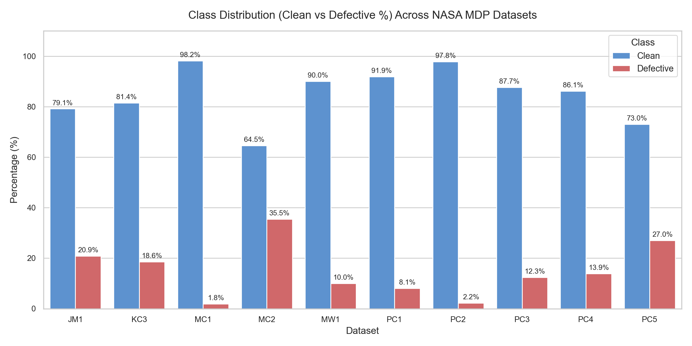

> [!IMPORTANT]
> **Nhận xét quan trọng về Mất cân bằng lớp (Class Imbalance)**:
> - Tất cả các bộ dữ liệu đều có hiện tượng mất cân bằng lớp từ vừa đến cực kỳ nghiêm trọng.
> - Bộ dữ liệu **PC2** mất cân bằng nhất với chỉ **2.15%** số lượng mẫu là lỗi (16 mẫu lỗi trên tổng số 745 mẫu).
> - Bộ dữ liệu **MC2** có tỷ lệ lỗi cao nhất với **35.20%** mẫu lỗi, tiếp theo là **PC5** với **27.53%**.
> - Việc mất cân bằng lớp cực đoan này đòi hỏi bắt buộc phải sử dụng các kỹ thuật cân bằng dữ liệu như **SMOTE** trong quá trình huấn luyện mô hình học máy (như mô tả trong [rule.md](file:///D:/WORKSPACE/KPDL/Software_Defect_Prediction/rule.md)).

> [!WARNING]
> **Nhận xét về Mẫu trùng lặp (Duplicates)**:
> - Các bộ dữ liệu như **MC1** chứa tới **1.81%** mẫu trùng lặp, **JM1** chứa **0.78%** mẫu trùng lặp.
> - Đây chính là đặc trưng của phiên bản gốc $DS'$. Việc loại bỏ mẫu trùng lặp và không nhất quán để tạo phiên bản sạch $DS''$ (của Shepperd) là cực kỳ cần thiết để đảm bảo tính khách quan cho mô hình học máy, tránh hiện tượng mô hình học vẹt các mẫu trùng lặp.

## 2. Chi Tiết Từng Bộ Dữ Liệu & Phân Tích Đặc Trưng Nhóm Metrics

### JM1

- **Kích thước**: 7720 dòng, 21 cột đặc trưng.
- **Cột chỉ số LOC đã xác định**: `LOC_TOTAL`
- **Cột chỉ số McCabe đã xác định**: `CYCLOMATIC_COMPLEXITY`
- **Cột chỉ số Halstead đã xác định**: `HALSTEAD_VOLUME`
- **Số cặp đặc trưng dư thừa (Correlation Spearman > 0.85)**: 60

#### Phân Phối Của Các Nhóm Chỉ Số Cốt Lõi:
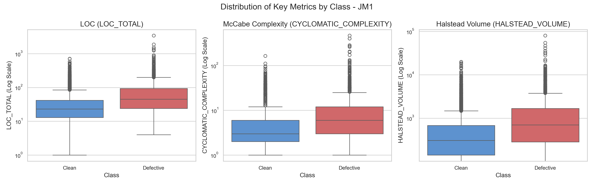

#### Bản Đồ Tương Quan Spearman (Top 15 Đặc Trưng):
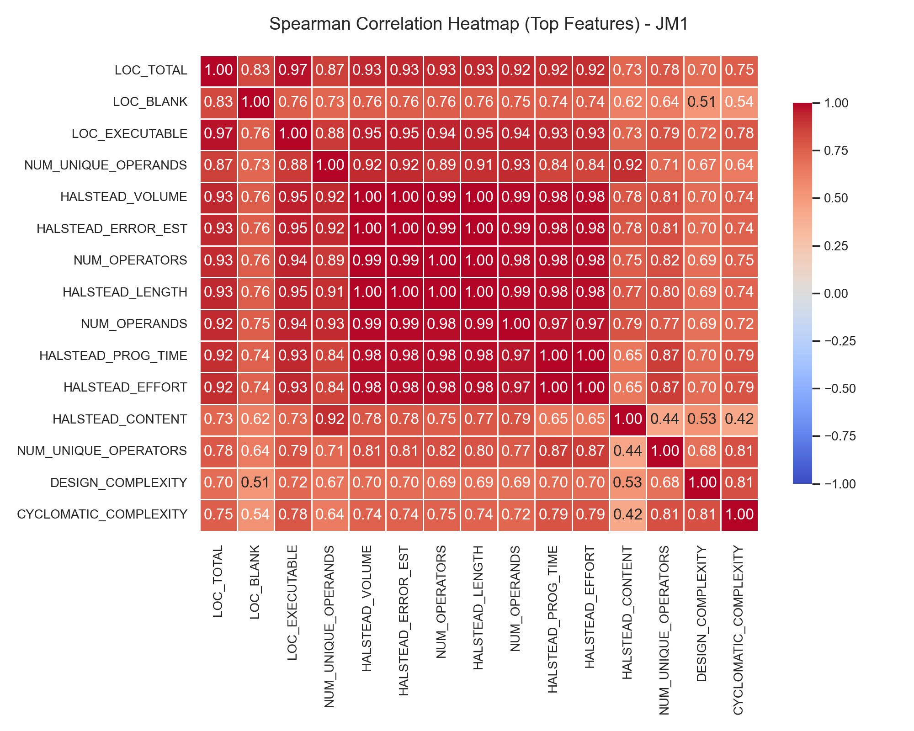

#### Top 5 Đặc trưng tương quan mạnh nhất với Nhãn Lỗi (Spearman):
| Thứ tự | Tên Đặc Trưng | Hệ số tương quan tuyệt đối |
| :---: | :--- | :---: |
| 1 | `LOC_TOTAL` | 0.2712 |
| 2 | `LOC_BLANK` | 0.2685 |
| 3 | `LOC_EXECUTABLE` | 0.2574 |
| 4 | `NUM_UNIQUE_OPERANDS` | 0.2526 |
| 5 | `HALSTEAD_VOLUME` | 0.2492 |

#### Top 5 Đặc trưng quan trọng nhất (Được đánh giá bằng Random Forest):
| Thứ tự | Tên Đặc Trưng | Độ quan trọng (Importance) |
| :---: | :--- | :---: |
| 1 | `LOC_TOTAL` | 0.0728 |
| 2 | `HALSTEAD_VOLUME` | 0.0672 |
| 3 | `LOC_EXECUTABLE` | 0.0670 |
| 4 | `HALSTEAD_CONTENT` | 0.0667 |
| 5 | `HALSTEAD_PROG_TIME` | 0.0619 |

---

### KC3

- **Kích thước**: 194 dòng, 39 cột đặc trưng.
- **Cột chỉ số LOC đã xác định**: `LOC_TOTAL`
- **Cột chỉ số McCabe đã xác định**: `CYCLOMATIC_COMPLEXITY`
- **Cột chỉ số Halstead đã xác định**: `HALSTEAD_VOLUME`
- **Số cặp đặc trưng dư thừa (Correlation Spearman > 0.85)**: 186

#### Phân Phối Của Các Nhóm Chỉ Số Cốt Lõi:
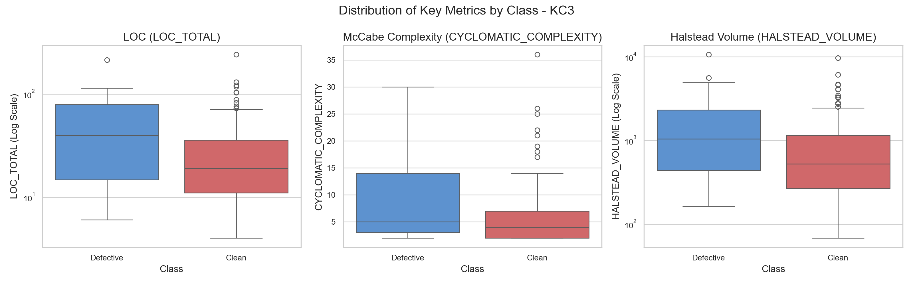

#### Bản Đồ Tương Quan Spearman (Top 15 Đặc Trưng):
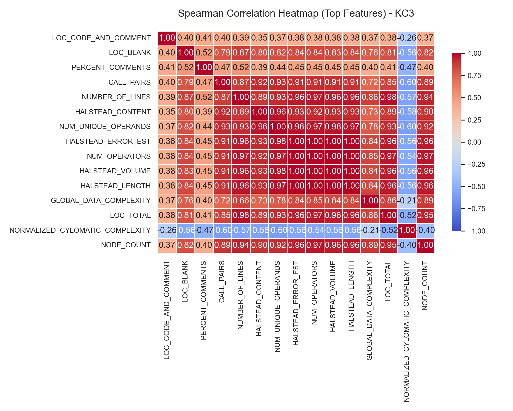

#### Top 5 Đặc trưng tương quan mạnh nhất với Nhãn Lỗi (Spearman):
| Thứ tự | Tên Đặc Trưng | Hệ số tương quan tuyệt đối |
| :---: | :--- | :---: |
| 1 | `LOC_CODE_AND_COMMENT` | 0.4027 |
| 2 | `LOC_BLANK` | 0.2781 |
| 3 | `PERCENT_COMMENTS` | 0.2534 |
| 4 | `CALL_PAIRS` | 0.2510 |
| 5 | `NUMBER_OF_LINES` | 0.2449 |

#### Top 5 Đặc trưng quan trọng nhất (Được đánh giá bằng Random Forest):
| Thứ tự | Tên Đặc Trưng | Độ quan trọng (Importance) |
| :---: | :--- | :---: |
| 1 | `LOC_CODE_AND_COMMENT` | 0.0663 |
| 2 | `PERCENT_COMMENTS` | 0.0462 |
| 3 | `HALSTEAD_EFFORT` | 0.0362 |
| 4 | `LOC_TOTAL` | 0.0358 |
| 5 | `HALSTEAD_DIFFICULTY` | 0.0356 |

---

### MC1

- **Kích thước**: 1952 dòng, 38 cột đặc trưng.
- **Cột chỉ số LOC đã xác định**: `LOC_TOTAL`
- **Cột chỉ số McCabe đã xác định**: `CYCLOMATIC_COMPLEXITY`
- **Cột chỉ số Halstead đã xác định**: `HALSTEAD_VOLUME`
- **Số cặp đặc trưng dư thừa (Correlation Spearman > 0.85)**: 100

#### Phân Phối Của Các Nhóm Chỉ Số Cốt Lõi:
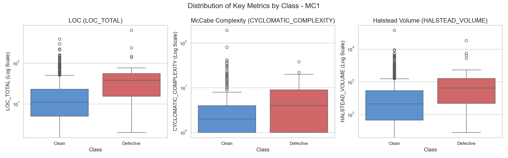

#### Bản Đồ Tương Quan Spearman (Top 15 Đặc Trưng):
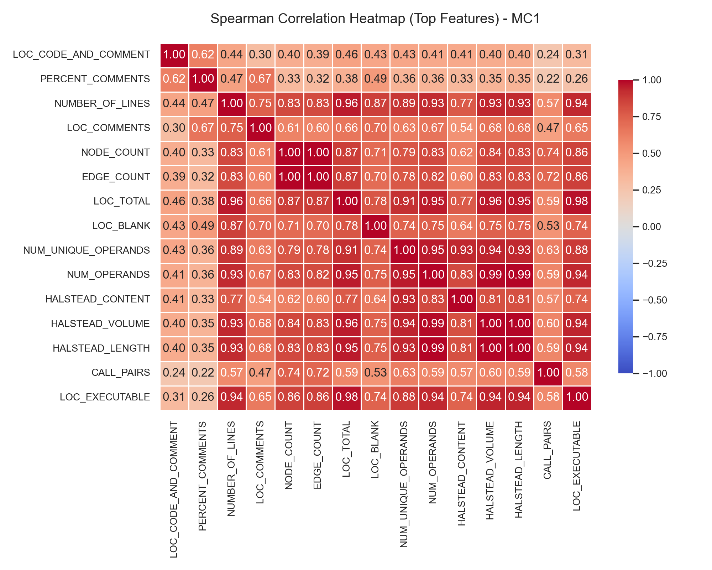

#### Top 5 Đặc trưng tương quan mạnh nhất với Nhãn Lỗi (Spearman):
| Thứ tự | Tên Đặc Trưng | Hệ số tương quan tuyệt đối |
| :---: | :--- | :---: |
| 1 | `LOC_CODE_AND_COMMENT` | 0.1643 |
| 2 | `PERCENT_COMMENTS` | 0.1173 |
| 3 | `NUMBER_OF_LINES` | 0.1094 |
| 4 | `LOC_COMMENTS` | 0.1092 |
| 5 | `NODE_COUNT` | 0.1090 |

#### Top 5 Đặc trưng quan trọng nhất (Được đánh giá bằng Random Forest):
| Thứ tự | Tên Đặc Trưng | Độ quan trọng (Importance) |
| :---: | :--- | :---: |
| 1 | `PERCENT_COMMENTS` | 0.0682 |
| 2 | `HALSTEAD_CONTENT` | 0.0481 |
| 3 | `NUMBER_OF_LINES` | 0.0474 |
| 4 | `LOC_CODE_AND_COMMENT` | 0.0459 |
| 5 | `CALL_PAIRS` | 0.0450 |

---

### MC2

- **Kích thước**: 124 dòng, 39 cột đặc trưng.
- **Cột chỉ số LOC đã xác định**: `LOC_TOTAL`
- **Cột chỉ số McCabe đã xác định**: `CYCLOMATIC_COMPLEXITY`
- **Cột chỉ số Halstead đã xác định**: `HALSTEAD_VOLUME`
- **Số cặp đặc trưng dư thừa (Correlation Spearman > 0.85)**: 144

#### Phân Phối Của Các Nhóm Chỉ Số Cốt Lõi:
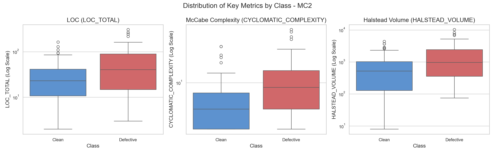

#### Bản Đồ Tương Quan Spearman (Top 15 Đặc Trưng):
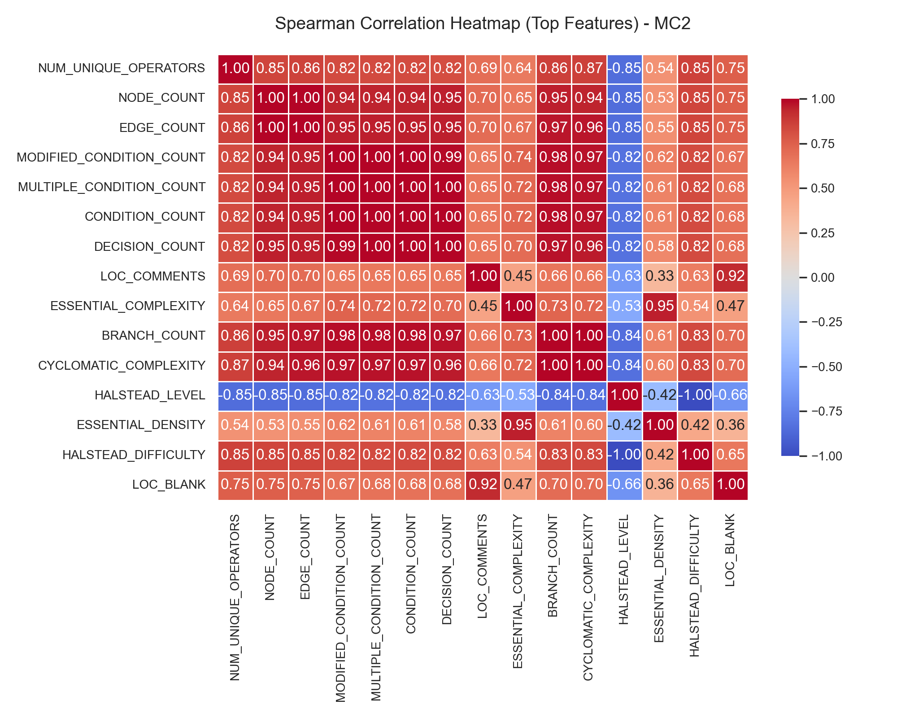

#### Top 5 Đặc trưng tương quan mạnh nhất với Nhãn Lỗi (Spearman):
| Thứ tự | Tên Đặc Trưng | Hệ số tương quan tuyệt đối |
| :---: | :--- | :---: |
| 1 | `NUM_UNIQUE_OPERATORS` | 0.3565 |
| 2 | `NODE_COUNT` | 0.3532 |
| 3 | `EDGE_COUNT` | 0.3517 |
| 4 | `MODIFIED_CONDITION_COUNT` | 0.3506 |
| 5 | `MULTIPLE_CONDITION_COUNT` | 0.3499 |

#### Top 5 Đặc trưng quan trọng nhất (Được đánh giá bằng Random Forest):
| Thứ tự | Tên Đặc Trưng | Độ quan trọng (Importance) |
| :---: | :--- | :---: |
| 1 | `HALSTEAD_DIFFICULTY` | 0.0598 |
| 2 | `HALSTEAD_PROG_TIME` | 0.0492 |
| 3 | `MAINTENANCE_SEVERITY` | 0.0450 |
| 4 | `HALSTEAD_EFFORT` | 0.0443 |
| 5 | `NODE_COUNT` | 0.0411 |

---

### MW1

- **Kích thước**: 250 dòng, 37 cột đặc trưng.
- **Cột chỉ số LOC đã xác định**: `LOC_TOTAL`
- **Cột chỉ số McCabe đã xác định**: `CYCLOMATIC_COMPLEXITY`
- **Cột chỉ số Halstead đã xác định**: `HALSTEAD_VOLUME`
- **Số cặp đặc trưng dư thừa (Correlation Spearman > 0.85)**: 102

#### Phân Phối Của Các Nhóm Chỉ Số Cốt Lõi:
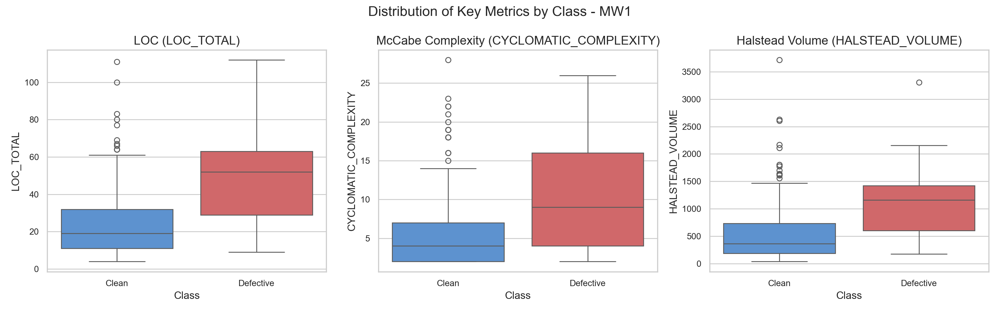

#### Bản Đồ Tương Quan Spearman (Top 15 Đặc Trưng):
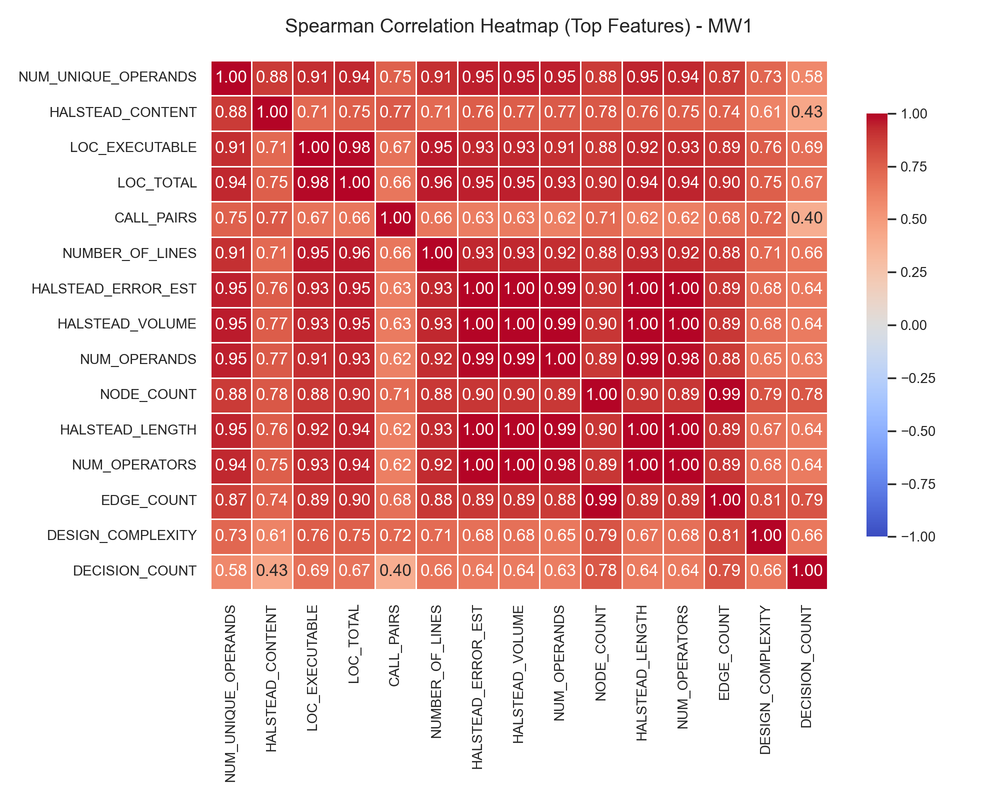

#### Top 5 Đặc trưng tương quan mạnh nhất với Nhãn Lỗi (Spearman):
| Thứ tự | Tên Đặc Trưng | Hệ số tương quan tuyệt đối |
| :---: | :--- | :---: |
| 1 | `NUM_UNIQUE_OPERANDS` | 0.3205 |
| 2 | `HALSTEAD_CONTENT` | 0.3022 |
| 3 | `LOC_EXECUTABLE` | 0.2971 |
| 4 | `LOC_TOTAL` | 0.2936 |
| 5 | `CALL_PAIRS` | 0.2931 |

#### Top 5 Đặc trưng quan trọng nhất (Được đánh giá bằng Random Forest):
| Thứ tự | Tên Đặc Trưng | Độ quan trọng (Importance) |
| :---: | :--- | :---: |
| 1 | `CALL_PAIRS` | 0.0665 |
| 2 | `NODE_COUNT` | 0.0664 |
| 3 | `LOC_BLANK` | 0.0587 |
| 4 | `HALSTEAD_CONTENT` | 0.0549 |
| 5 | `NUMBER_OF_LINES` | 0.0510 |

---

### PC1

- **Kích thước**: 679 dòng, 37 cột đặc trưng.
- **Cột chỉ số LOC đã xác định**: `LOC_TOTAL`
- **Cột chỉ số McCabe đã xác định**: `CYCLOMATIC_COMPLEXITY`
- **Cột chỉ số Halstead đã xác định**: `HALSTEAD_VOLUME`
- **Số cặp đặc trưng dư thừa (Correlation Spearman > 0.85)**: 116

#### Phân Phối Của Các Nhóm Chỉ Số Cốt Lõi:
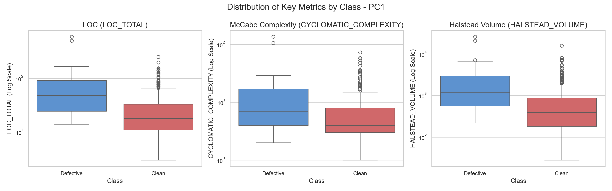

#### Bản Đồ Tương Quan Spearman (Top 15 Đặc Trưng):
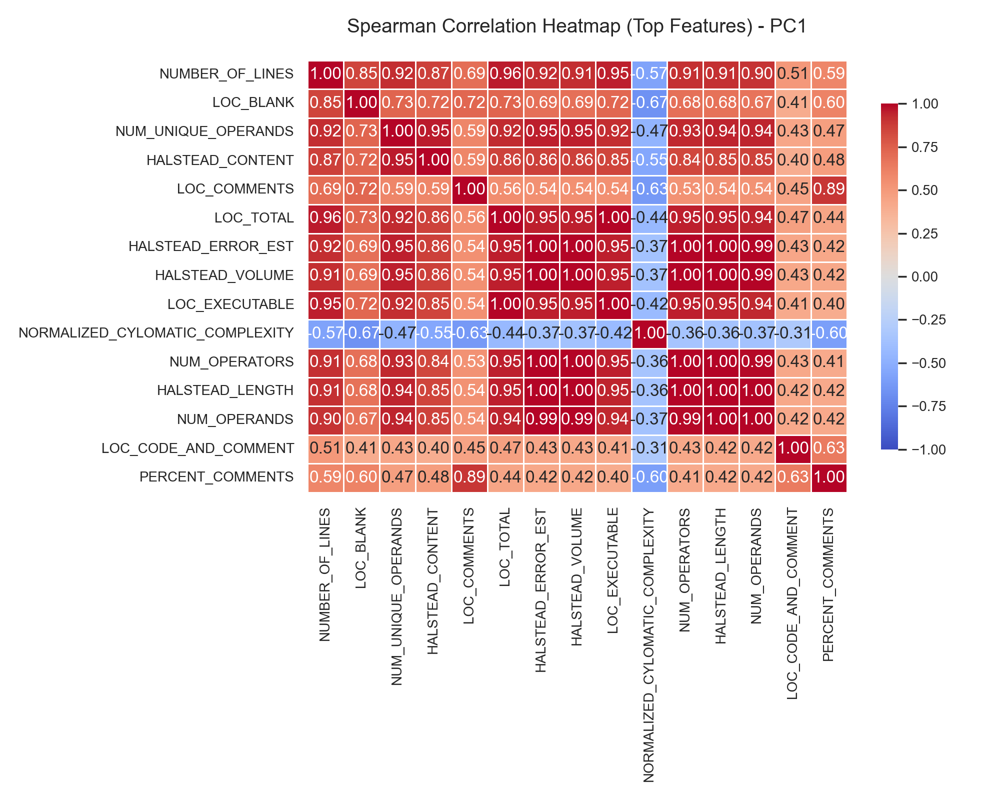

#### Top 5 Đặc trưng tương quan mạnh nhất với Nhãn Lỗi (Spearman):
| Thứ tự | Tên Đặc Trưng | Hệ số tương quan tuyệt đối |
| :---: | :--- | :---: |
| 1 | `NUMBER_OF_LINES` | 0.3107 |
| 2 | `LOC_BLANK` | 0.3085 |
| 3 | `NUM_UNIQUE_OPERANDS` | 0.2956 |
| 4 | `HALSTEAD_CONTENT` | 0.2932 |
| 5 | `LOC_COMMENTS` | 0.2909 |

#### Top 5 Đặc trưng quan trọng nhất (Được đánh giá bằng Random Forest):
| Thứ tự | Tên Đặc Trưng | Độ quan trọng (Importance) |
| :---: | :--- | :---: |
| 1 | `NUMBER_OF_LINES` | 0.0725 |
| 2 | `LOC_COMMENTS` | 0.0670 |
| 3 | `HALSTEAD_CONTENT` | 0.0568 |
| 4 | `LOC_CODE_AND_COMMENT` | 0.0522 |
| 5 | `LOC_BLANK` | 0.0429 |

---

### PC2

- **Kích thước**: 722 dòng, 36 cột đặc trưng.
- **Cột chỉ số LOC đã xác định**: `LOC_TOTAL`
- **Cột chỉ số McCabe đã xác định**: `CYCLOMATIC_COMPLEXITY`
- **Cột chỉ số Halstead đã xác định**: `HALSTEAD_VOLUME`
- **Số cặp đặc trưng dư thừa (Correlation Spearman > 0.85)**: 106

#### Phân Phối Của Các Nhóm Chỉ Số Cốt Lõi:
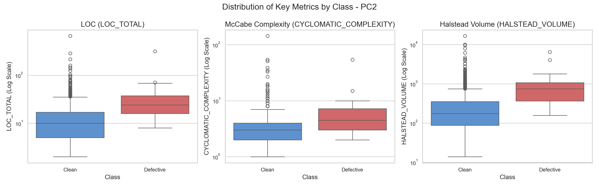

#### Bản Đồ Tương Quan Spearman (Top 15 Đặc Trưng):
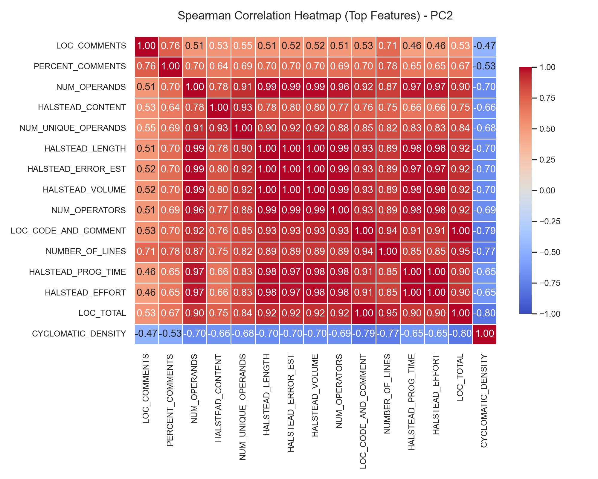

#### Top 5 Đặc trưng tương quan mạnh nhất với Nhãn Lỗi (Spearman):
| Thứ tự | Tên Đặc Trưng | Hệ số tương quan tuyệt đối |
| :---: | :--- | :---: |
| 1 | `LOC_COMMENTS` | 0.1917 |
| 2 | `PERCENT_COMMENTS` | 0.1849 |
| 3 | `NUM_OPERANDS` | 0.1722 |
| 4 | `HALSTEAD_CONTENT` | 0.1721 |
| 5 | `NUM_UNIQUE_OPERANDS` | 0.1700 |

#### Top 5 Đặc trưng quan trọng nhất (Được đánh giá bằng Random Forest):
| Thứ tự | Tên Đặc Trưng | Độ quan trọng (Importance) |
| :---: | :--- | :---: |
| 1 | `PERCENT_COMMENTS` | 0.0861 |
| 2 | `HALSTEAD_CONTENT` | 0.0435 |
| 3 | `DESIGN_DENSITY` | 0.0407 |
| 4 | `HALSTEAD_EFFORT` | 0.0403 |
| 5 | `LOC_COMMENTS` | 0.0375 |

---

### PC3

- **Kích thước**: 1053 dòng, 37 cột đặc trưng.
- **Cột chỉ số LOC đã xác định**: `LOC_TOTAL`
- **Cột chỉ số McCabe đã xác định**: `CYCLOMATIC_COMPLEXITY`
- **Cột chỉ số Halstead đã xác định**: `HALSTEAD_VOLUME`
- **Số cặp đặc trưng dư thừa (Correlation Spearman > 0.85)**: 90

#### Phân Phối Của Các Nhóm Chỉ Số Cốt Lõi:
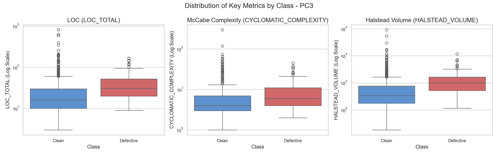

#### Bản Đồ Tương Quan Spearman (Top 15 Đặc Trưng):
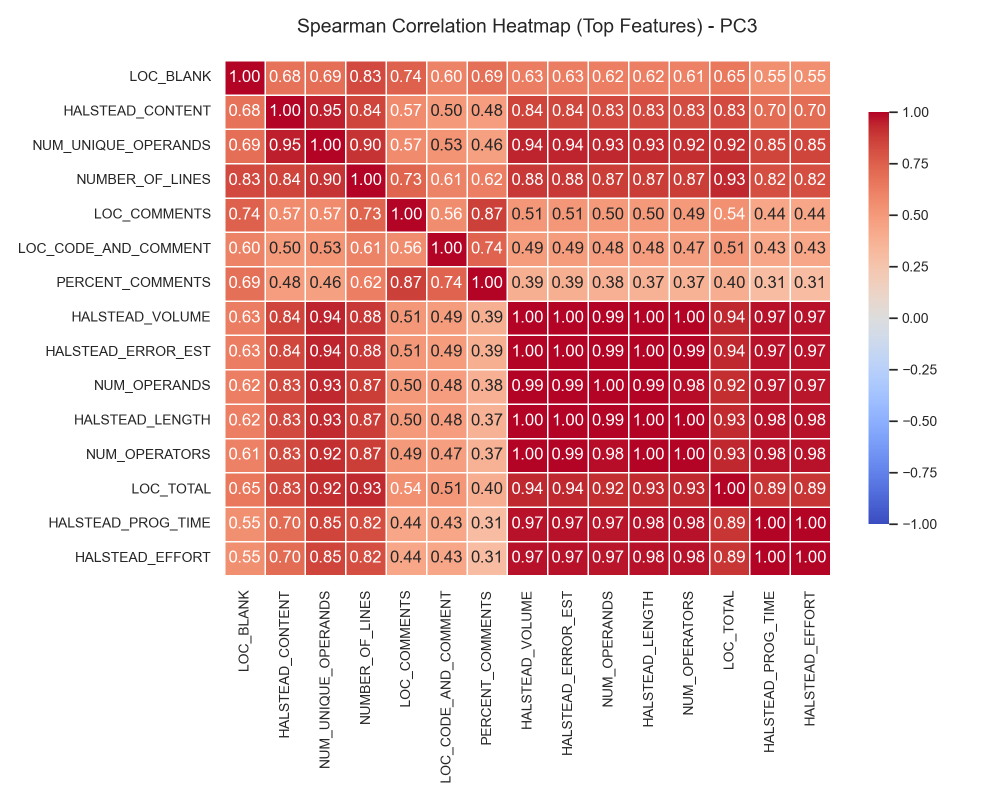

#### Top 5 Đặc trưng tương quan mạnh nhất với Nhãn Lỗi (Spearman):
| Thứ tự | Tên Đặc Trưng | Hệ số tương quan tuyệt đối |
| :---: | :--- | :---: |
| 1 | `LOC_BLANK` | 0.3615 |
| 2 | `HALSTEAD_CONTENT` | 0.3394 |
| 3 | `NUM_UNIQUE_OPERANDS` | 0.3270 |
| 4 | `NUMBER_OF_LINES` | 0.3247 |
| 5 | `LOC_COMMENTS` | 0.3069 |

#### Top 5 Đặc trưng quan trọng nhất (Được đánh giá bằng Random Forest):
| Thứ tự | Tên Đặc Trưng | Độ quan trọng (Importance) |
| :---: | :--- | :---: |
| 1 | `LOC_BLANK` | 0.0752 |
| 2 | `HALSTEAD_CONTENT` | 0.0566 |
| 3 | `PERCENT_COMMENTS` | 0.0525 |
| 4 | `NUMBER_OF_LINES` | 0.0514 |
| 5 | `NUM_UNIQUE_OPERANDS` | 0.0419 |

---

### PC4

- **Kích thước**: 1270 dòng, 37 cột đặc trưng.
- **Cột chỉ số LOC đã xác định**: `LOC_TOTAL`
- **Cột chỉ số McCabe đã xác định**: `CYCLOMATIC_COMPLEXITY`
- **Cột chỉ số Halstead đã xác định**: `HALSTEAD_VOLUME`
- **Số cặp đặc trưng dư thừa (Correlation Spearman > 0.85)**: 85

#### Phân Phối Của Các Nhóm Chỉ Số Cốt Lõi:
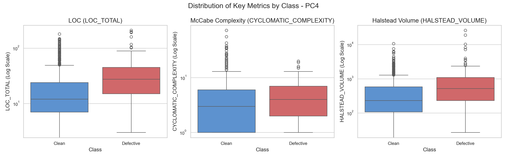

#### Bản Đồ Tương Quan Spearman (Top 15 Đặc Trưng):
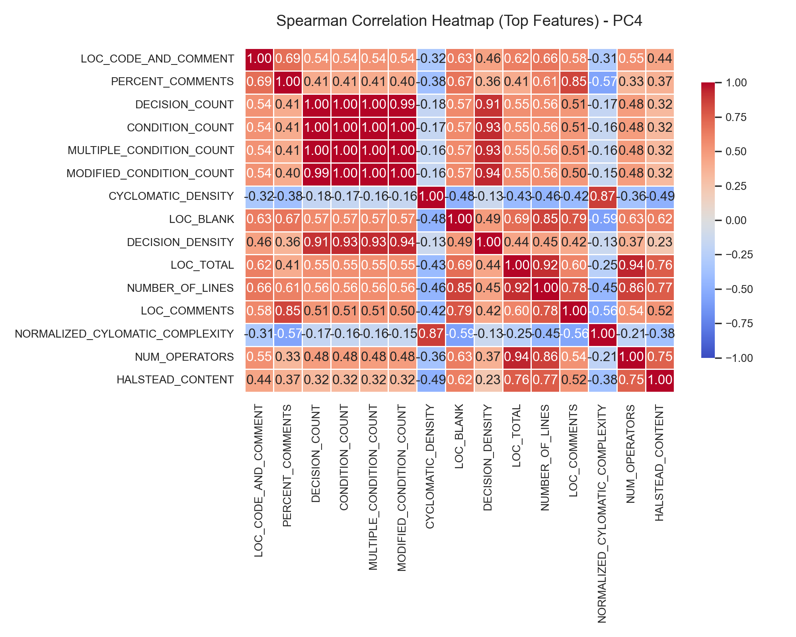

#### Top 5 Đặc trưng tương quan mạnh nhất với Nhãn Lỗi (Spearman):
| Thứ tự | Tên Đặc Trưng | Hệ số tương quan tuyệt đối |
| :---: | :--- | :---: |
| 1 | `LOC_CODE_AND_COMMENT` | 0.4681 |
| 2 | `PERCENT_COMMENTS` | 0.3198 |
| 3 | `DECISION_COUNT` | 0.3035 |
| 4 | `CONDITION_COUNT` | 0.3011 |
| 5 | `MULTIPLE_CONDITION_COUNT` | 0.3010 |

#### Top 5 Đặc trưng quan trọng nhất (Được đánh giá bằng Random Forest):
| Thứ tự | Tên Đặc Trưng | Độ quan trọng (Importance) |
| :---: | :--- | :---: |
| 1 | `LOC_CODE_AND_COMMENT` | 0.1534 |
| 2 | `PERCENT_COMMENTS` | 0.0641 |
| 3 | `CYCLOMATIC_DENSITY` | 0.0444 |
| 4 | `LOC_COMMENTS` | 0.0433 |
| 5 | `HALSTEAD_CONTENT` | 0.0377 |

---

### PC5

- **Kích thước**: 1694 dòng, 38 cột đặc trưng.
- **Cột chỉ số LOC đã xác định**: `LOC_TOTAL`
- **Cột chỉ số McCabe đã xác định**: `CYCLOMATIC_COMPLEXITY`
- **Cột chỉ số Halstead đã xác định**: `HALSTEAD_VOLUME`
- **Số cặp đặc trưng dư thừa (Correlation Spearman > 0.85)**: 132

#### Phân Phối Của Các Nhóm Chỉ Số Cốt Lõi:
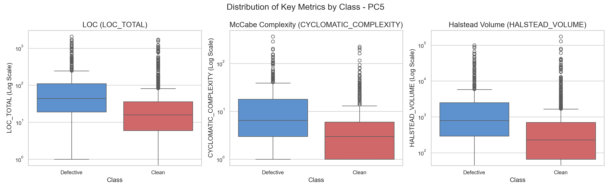

#### Bản Đồ Tương Quan Spearman (Top 15 Đặc Trưng):
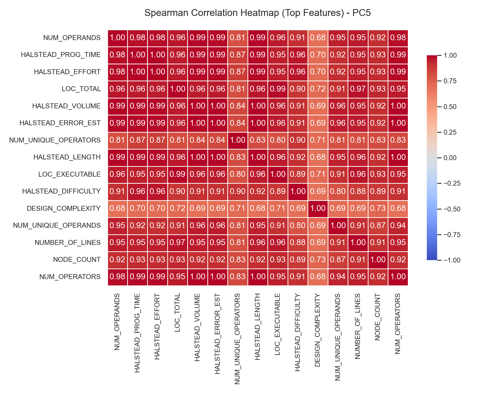

#### Top 5 Đặc trưng tương quan mạnh nhất với Nhãn Lỗi (Spearman):
| Thứ tự | Tên Đặc Trưng | Hệ số tương quan tuyệt đối |
| :---: | :--- | :---: |
| 1 | `NUM_OPERANDS` | 0.3596 |
| 2 | `HALSTEAD_PROG_TIME` | 0.3570 |
| 3 | `HALSTEAD_EFFORT` | 0.3570 |
| 4 | `LOC_TOTAL` | 0.3554 |
| 5 | `HALSTEAD_VOLUME` | 0.3534 |

#### Top 5 Đặc trưng quan trọng nhất (Được đánh giá bằng Random Forest):
| Thứ tự | Tên Đặc Trưng | Độ quan trọng (Importance) |
| :---: | :--- | :---: |
| 1 | `HALSTEAD_DIFFICULTY` | 0.0462 |
| 2 | `HALSTEAD_EFFORT` | 0.0432 |
| 3 | `HALSTEAD_VOLUME` | 0.0415 |
| 4 | `HALSTEAD_PROG_TIME` | 0.0410 |
| 5 | `NUM_OPERANDS` | 0.0405 |

---

## 3. Kết Luận Định Hướng Cho Mô Hình Học Máy

1. **Đa cộng tuyến cực kỳ nghiêm trọng (Collinearity)**:
   - Hầu hết các bộ dữ liệu đều có số lượng rất lớn các cặp đặc trưng tương quan Spearman trên **0.85** hoặc thậm chí **0.99** (đặc biệt trong các đặc trưng Halstead và LOC).
   - *Khuyến nghị*: Nên áp dụng các phương pháp giảm chiều dữ liệu (PCA), hoặc lựa chọn đặc trưng (Feature Selection), hoặc sử dụng các bộ phân loại ít nhạy cảm với đa cộng tuyến như **Random Forest** hay **Decision Trees** thay vì Logistic Regression thuần túy.

2. **Độ lệch của Đặc trưng (Feature Skewness)**:
   - Các đặc trưng đo lường kích thước như LOC và Volume đều cực kỳ lệch phải (Right-skewed) với một vài hàm/mô-đun có kích thước khổng lồ kéo dài đuôi phân phối.
   - *Khuyến nghị*: Việc chuẩn hóa bằng **StandardScaler** và lấy Log-transform là bước tiền xử lý bắt buộc đối với các thuật toán nhạy cảm với thang đo như **SVM** và **Logistic Regression**.

3. **Xử lý Mất cân bằng lớp An Toàn**:
   - Như đã cảnh báo, **SMOTE** là bắt buộc. Tuy nhiên, việc áp dụng SMOTE phải được thực hiện **sau khi chia tách fold kiểm định** (đóng gói trong `imblearn.pipeline`) để loại bỏ hoàn toàn nguy cơ **Rò rỉ thông tin dữ liệu (Data Leakage)**.
